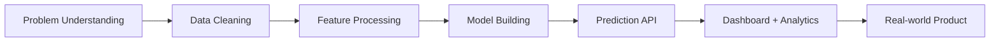

 

---

## About Me

I am **Siddhi Gupta**, a **B.Tech Computer Science & Engineering student** focused on AI/ML, full-stack ML applications, and data analytics.

My work is centered on building practical systems where machine-learning logic connects with usable software: prediction APIs, dashboards, databases, analytics workflows, and user-facing interfaces.

**Current direction**

- Machine-learning workflows: data cleaning, preprocessing, feature processing, and model building
- Full-stack ML apps: Flask prediction services, Node.js/Express APIs, MySQL storage, authentication, and dashboards
- Data analytics: Power BI, Tableau, Advanced Excel, and structured reporting
- Applied AI domains: fraud detection, legal-tech access, medical-image detection, and disaster-response systems

---

## Featured Projects

<table>
<tr>
<td width="50%" valign="top">

### PulseShield — ML Fraud Detection

A full-stack fraud detection system combining a **Python/Flask ML service**, **Node.js/Express backend**, **MySQL database**, and a responsive analytics dashboard.

**Built around**

- Fraud probability scoring
- JWT authentication
- Real-time updates with Socket.IO
- Transaction history and CSV export
- Responsive frontend with dark/light theme

**Stack:** Python, Flask, Scikit-learn, Pandas, NumPy, JavaScript, Node.js, Express, MySQL, Socket.IO, Bootstrap, Tailwind CSS

[Repository](https://github.com/siddhi3030/E-Commerece-Fraud-Detection)

</td>
<td width="50%" valign="top">

### SHVET: Your Shield — Legal-Tech Platform

A legal-tech mobile application concept for reducing legal illiteracy and improving access to justice by connecting users with verified lawyers in native languages.

**Built around**

- ML-based lawyer recommendation by case type, language, and location
- Multilingual legal assistance
- Legal awareness blogs, case studies, and quizzes
- Privacy-conscious and affordability-focused design
- SDG-16 aligned problem statement

</td>
</tr>
<tr>
<td width="50%" valign="top">

### Kidney Stone Detection Using Deep Learning

A medical-imaging project applying CNN-based deep-learning methods to detect kidney stones from ultrasound/CT scan images.

**Built around**

- Image preprocessing
- Data augmentation
- CNN-based classification
- VGG16 and ResNet feature-extraction approach
- Early diagnosis assistance

</td>
<td width="50%" valign="top">

### Disaster Management Early Warning System

A disaster-response application designed for early earthquake alerts and real-time safe-location sharing during emergencies.

**Built around**

- Early alert support
- Nearby safe-location discovery
- Community-updated safe locations
- Social-feed style emergency updates
- Accessibility-first safety workflow

</td>
</tr>
</table>

---

## AI / ML / Data Stack

### Languages & CS Core

### AI, ML & Data

### Full-Stack ML Application Tools

### Frontend & Analytics

### Tools

---

## Certifications & Training

- **IBM SkillsBuild:** Generative AI, Data Science, RAG
- **NPTEL:** Python for Data Science
- **MHRD Innovation Cell:** IA Online Training Certificate
- **Udemy:** Java DSA Certification

---

## GitHub Analytics

 

 

---

## AI Engineering Workflow I Am Building Toward

---

## Selected Achievements

Open achievements

- Secured **All India Rank 19** in the Bharat and Its Scientific Glory competition.
- Secured **1st Position** in AdMad and **3rd Position** in Business Plan Competition at AKTU Literary, Management & Technical Fest 2025 Zonals.
- Won **Gold Medal in Table Tennis** at AKTU Zonal Sports for three consecutive years: 2023, 2024, and 2025.
- Secured **1st Position** in BRAINSPARK'25 seminar challenge.
- Secured **1st Position** in the "Journey of Start-ups" presentation competition.
- Secured multiple positions at TECHVYOM 2025 and Technovaganza 2025 across business plan, paper presentation, code relay, code sense, and analytical events.

---

### Building practical AI systems, one project at a time.

