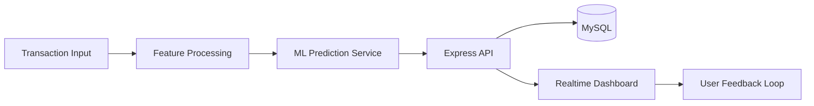
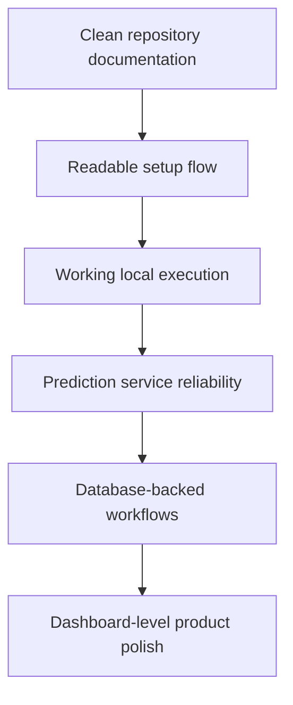

 

---

## System Focus

I build and document **ML-powered web systems** where prediction logic connects with backend APIs, databases, dashboards, and user-facing interfaces.

This profile is based only on repositories currently visible on this GitHub account. No resume-only projects, certifications, achievements, or unrelated skills are listed here.

---

## Repository-Backed Projects

<table>
<tr>
<td width="50%" valign="top">

### PulseShield — E-Commerce Fraud Detection

A full-stack fraud detection application built around a **Flask ML service**, **Node.js/Express API**, **MySQL persistence**, and **real-time dashboard updates**.

**Repository-backed capabilities**

- Transaction fraud scoring
- Flask prediction endpoint
- Pickle-based model asset loading
- Rule-based fallback scoring when model assets are unavailable
- JWT-protected transaction routes
- MySQL-backed user and transaction storage
- Socket.IO event emission for new transactions
- CSV export for transaction records

**Stack visible in repo**

`Python` · `Flask` · `Pandas` · `NumPy` · `Scikit-learn` · `Node.js` · `Express.js` · `MySQL` · `Socket.IO` · `JWT` · `Axios` · `HTML` · `CSS` · `JavaScript`

[Open Repository](https://github.com/siddhi3030/E-Commerece-Fraud-Detection)

</td>
<td width="50%" valign="top">

### Mental Health Of People In IT Industry

A documentation-stage repository for organizing a responsible analysis project around mental-health patterns in IT workplaces.

**Current repository status**

- README documentation exists
- No repository-backed dataset conclusions are claimed
- No model, notebook, dashboard, or analysis result is claimed without committed files
- Structured as a clean project space for future data work

[Open Repository](https://github.com/siddhi3030/Mental-Health-Of-People-In-IT-Industry)

</td>
</tr>
</table>

---

## Tech Stack From Current Repositories

### Machine Learning / Data Handling

### Backend / Realtime / Database

### Frontend

### Tools

---

## GitHub Analytics

 

 

---

## Current Engineering Direction

---

### Repository-backed. No fake claims. No filler.

